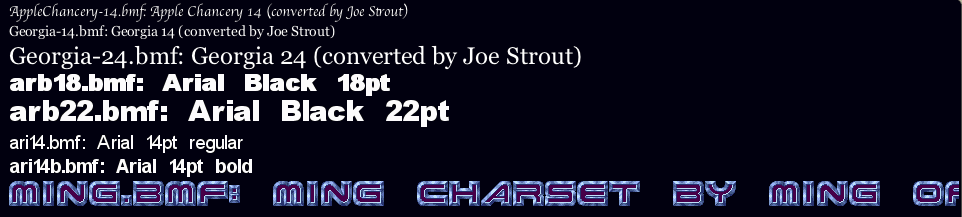

# minimicro-fonts
Bytemap screen font support for Mini Micro


## Purpose

This repo provides code to read and render bitmap fonts in the "ByteMap Font" (BMF) format, as described here: https://bmf.php5.cz/?page=format

It also includes some sample font files that I believe to be in the public domain.  You can find thousands more at the web site above.

## Usage

Use this code with [Mini Micro](https://miniscript.org/MiniMicro).  Mini Micro is a fun, free, retro-style virtual computer based on [MiniScript](https://miniscript.org/), which is itself a clean, simple, modern scripting language.

Place the bmfFonts.ms file somewhere in your import path (the current working directory will do; /usr/lib is also a good place).  Then use `import "bmfFonts"` to load the bmfFonts module, and `bmfFonts.Font.load` to load a font.

```
import "bmfFonts"

// Load a font
f = bmfFonts.Font.load("fonts/ming.bmf")

// Print a string in that font to gfx
f.print "Hello world!", 20, 500

// Get a character image, and make a Sprite out of it
spr = new Sprite
spr.image = f.getCharImage("R")
spr.x = 600
spr.y = 500
spr.scale = 3
spr.rotation = 30
display(4).sprites.push spr
```

The `Font.print` method also takes an optional `scale` parameter (defaults to 1.0), allowing you to print larger or smaller than the default.

If you run `bmfFonts.demo` (or load and run the module directly instead of using `import`), it will look for the fonts folder, and draw a string with each one.  The final font will be drawn at 3X scale at the bottom of the screen. The result should look something like this:



## BMF Version Support

This code supports both version 1.1 and version 1.2 of the BMF format.  Version 1.2 is a recent but significant upgrade, adding support for non-ASCII Unicode characters, kerning, and an alpha channel for anti-aliased fonts.


